<div align="center">

<!-- Brutalist B&W Glitch Banner -->


<br/>

<!-- Monochrome Typing Subtitle -->
<a href="https://github.com/nikolaevsaryal10-byte">
  
</a>

<br/><br/>

<!-- Monochrome Status Badges -->
<p align="center">
  
  &nbsp;
  
  &nbsp;
  
  &nbsp;
  
</p>

</div>

---

### ⚡ ТЕРМИНАЛ // TERMINAL ACCESS

```
╭─────────────────────────────────────────────────────────────────────────────╮
│ ░▒▓█ SYSTEM_INIT // ТЕРМИНАЛ РАЗРАБОТЧИКА // 0x73F7                         │
│ ◈ ПОЗЫВНОЙ   : AltzGamerz 「幽灵」                                          │
│ ◈ АЛИАС      : @nikolaevsaryal10-byte                                       │
│ ◈ СТЕК       : Full-Stack & Systems Architect • Cyberdeck Engineering       │
│ ◈ ЦЕЛЬ       : Высокоскоростные сети • Обход цензуры • Отказоустойчивость   │
│ ◈ ФЛАГМАН    : TABIS VPN 「塔比斯」 (Cross-Platform Censorship-Resistant VPN)│
╰─────────────────────────────────────────────────────────────────────────────╯
```

> Проектирую высокопроизводительные сетевые сервисы, асинхронные бэкенды и нативные клиенты с упором на криптографию, устойчивость к DPI-блокировкам и приватность данных.

---

### 🛡️ ФЛАГМАНСКИЙ ПРОЕКТ // [TABIS VPN](https://github.com/nikolaevsaryal10-byte/tabisvpn) 「 塔比斯 」

<div align="center">
  
  &nbsp;
  
  &nbsp;
  
  &nbsp;
  
  &nbsp;
  
</div>

<br/>

**TABIS VPN (ТАБЫС)** — высоконагруженная кроссплатформенная экосистема защищённого туннелирования и обхода блокировок. Проект объединяет нативное Android-приложение на Kotlin Compose, асинхронный серверный центр на FastAPI с автоматизированным биллингом и фискализацией, десктопный модуль и веб-портал.

```
                    ┌─────────────────────────────────────────────────────────┐
                    │               TABIS CYBERDECK ECOSYSTEM                 │
                    │               Архитектура сетевой экосистемы             │
                    └────────────────────────────┬────────────────────────────┘
                                                 │
         ┌───────────────────────┬───────────────┴───────────────┬───────────────────────┐
         ▼                       ▼                               ▼                       ▼
┌──────────────────┐   ┌──────────────────┐            ┌──────────────────┐   ┌──────────────────┐
│   MOBILE NODE    │   │  DESKTOP RELAY   │            │   WEB MATRIX     │   │  SECURITY CORE   │
│  Клиент Android  │   │ Клиент Windows   │            │   Веб-портал     │   │  Протоколы ядра  │
├──────────────────┤   ├──────────────────┤            ├──────────────────┤   ├──────────────────┤
│ • Kotlin 2.x     │   │ • Python 3.11+   │            │ • Tailwind CSS   │   │ • VLESS Reality  │
│ • JetpackCompose │   │ • WinINet API    │            │ • Vanilla ES6+   │   │ • Hysteria2 QUIC │
│ • Go Xray Core   │   │ • Реестр Windows │            │ • QRious QR Gen  │   │ • C HEV Tunnel   │
│ • C HEV Tunnel   │   │ • CustomTkinter  │            │ • Glassmorphism  │   │ • Argon2id Crypto│
└────────┬─────────┘   └────────┬─────────┘            └────────┬─────────┘   └────────┬─────────┘
         │                      │                               │                      │
         └──────────────────────┴───────────────┬───────────────┴──────────────────────┘
                                                ▼
                               ┌──────────────────────────────────┐
                               │       CORE BACKEND ENGINE        │
                               │   Серверный центр и демоны       │
                               ├──────────────────────────────────┤
                               │ • FastAPI + Uvicorn ASGI Сервер  │
                               │ • SQLite WAL Режим (Thread-Safe) │
                               │ • ЮKassa Фискализация 54-ФЗ      │
                               │ • 4 Фоновых системных демона     │
                               └──────────────────────────────────┘
```

---

#### ⚙️ 1. Бэкенд и системные демоны 「 核心 • Backend 」
- **Технологический стек:** `Python 3.11+`, `FastAPI`, `Uvicorn ASGI`, `SQLite3` с оптимизацией WAL (`PRAGMA journal_mode=WAL`), `Pydantic v2`.
- **Криптография и защита:** `Argon2id` для безопасного хеширования паролей, `AES-256-GCM` для шифрования клиентских полезных данных, `HMAC-SHA256` для проверки подлинности вебхуков.
- **Маршрутизация API (`routers/`):**
  - `auth.py` — аутентификация, выдача сессионных токенов, генерация криптографических одноразовых паролей (OTP).
  - `profile.py` — профиль пользователя, экспорт клиентских конфигураций, инициализация платежей.
  - `client.py` — протокол синхронизации мобильных клиентов, валидация ключей доступа.
  - `admin.py` — супервизор нод сервера, ручное продление подписок, сбор аналитики.
- **Автономные фоновые демоны (`services/`):**
  - `billing_service.py` — непрерывный контроль сроков подписок, grace-периоды, сверка транзакций.
  - `traffic_service.py` — потоковый сбор и агрегация сетевой телеметрии из журналов `journalctl` демона Hysteria 2.
  - `xray_service.py` — синтез динамических JSON-конфигураций Xray-core и балансировка входящих потоков.
  - `email_service.py` — асинхронный неблокирующий SMTP-диспетчер для кодов подтверждения и системных уведомлений.
- **Платёжная интеграция:** ЮKassa API с криптографической валидацией цифровых подписей вебхуков и автоматической фискализацией кассовых чеков согласно 54-ФЗ и 422-ФЗ.

---

#### 📱 2. Мобильный клиент Android 「 终端 • Mobile 」
- **Технологический стек:** `Kotlin 2.x`, `Android SDK 35 (minSdk 24)`, `Jetpack Compose`, `Material Design 3`, `Coroutines & StateFlow`, `Tencent MMKV`, `OkHttp3 / Retrofit`, `WorkManager`, `Gradle Kotlin DSL`.
- **Низкоуровневые ядра туннелирования:**
  - **`AndroidLibXrayLite` (Go / Go Mobile):** Скомпилированное в AAR ядро Xray-core v5 для гибкой маршрутизации VLESS, Trojan, Shadowsocks.
  - **`hev-socks5-tunnel` (C / CMake / Android NDK):** Ультралегковесный C-туннель для трансляции IP-пакетов из системного `VpnService` в сокеты SOCKS5 с околонулевым оверхедом по памяти и CPU.
- **Архитектура:** Чистый паттерн MVVM, раздельное туннелирование приложений (Split Tunneling), обход локальных подсетей и защищённый модуль самообновления с проверкой хэшей SHA-256.

---

#### 🌐 3. Веб-портал и дашборды 「 全息 • Web 」
- **Технологический стек:** `Modern HTML5`, `Tailwind CSS (Container Queries, Forms, Dark Mode)`, `Vanilla JS (ES6+ async/await)`, `Google Fonts (Inter, JetBrains Mono, Plus Jakarta Sans)`, `QRious`.
- **Интерфейсные модули:**
  - **Landing Portal (`index.html`, `/android`, `/windows`, `/ios`):** Отзывчивый Mobile-First портал со стилем Glassmorphism, тёмной темой и прямой раздачей скомпилированных дистрибутивов.
  - **Личный кабинет (`profile/auth`, `profile/`):** Личный терминал пользователя с мониторингом активного тарифа, таймером до истечения, прямой оплатой и динамическими QR-кодами для сопряжения устройств в один клик.
  - **Панель администратора (`admin/`):** Панель управления флотом серверов: пропускная способность нод, мониторинг нагрузки, аудит активности пользователей и потоковый просмотр системных логов.

---

#### 🖥️ 4. Десктопный клиент Windows 「 视窗 • Desktop 」
- **Технологический стек:** `Python 3.11+`, `CustomTkinter / Tkinter`, `WinINet API`.
- **Функционал:** Прямое управление системными параметрами прокси через реестр Windows без установки сторонних виртуальных сетевых адаптеров, фоновый супервизор локальных процессов ядра.

---

#### 🌀 5. Сетевые протоколы и маскировка 「 隐秘 • Stealth 」
- **VLESS + XTLS / Reality:** Имитирует легитимное TLS 1.3 рукопожатие к белым зарубежным сайтам, делая трафик абсолютно неотличимым от обычного веб-серфинга для систем глубокого анализа пакетов (DPI).
- **Hysteria 2 (QUIC / UDP):** Кастомный алгоритм контроля перегрузок на базе QUIC, обеспечивающий максимальную скорость даже при потере до 30% пакетов в нестабильных мобильных сетях.
- **Tun2Socks & HEV:** Перехват трафика на уровне ядра операционной системы, предотвращающий любые утечки DNS и IPv6.

---

### 💻 СТЕК ТЕХНОЛОГИЙ // ARSENAL

<div align="center">
  
</div>

<br/>

| Категория | Технологии | Назначение в проектах |
|:---|:---|:---|
| **「 语言 」 Языки** | `Kotlin`, `Python 3.11+`, `Go`, `C`, `JavaScript (ES6+)`, `Bash`, `SQL` | Полный цикл: от низкоуровневых C/Go туннелей ядра до реактивного UI и бэкенда |
| **「 移动 」 Android** | `Android SDK 35`, `Jetpack Compose`, `Material 3`, `VpnService`, `Tun2Socks`, `MMKV` | Нативная разработка высокопроизводительных VPN-клиентов |
| **「 核心 」 Backend** | `FastAPI`, `Uvicorn ASGI`, `SQLite (WAL mode)`, `Pydantic v2`, `RESTful APIs` | Высоконагруженные асинхронные REST-сервисы, фоновые демоны, потоковая телеметрия |
| **「 前端 」 Frontend** | `Tailwind CSS`, `HTML5 Semantic`, `Vanilla JS`, `QRious`, `Glassmorphism UI` | Отзывчивые интерфейсы, личный кабинет, админ-панель, генерация QR-кодов |
| **「 协议 」 Протоколы** | `VLESS`, `XTLS / Reality`, `Hysteria 2 (QUIC)`, `Trojan`, `Shadowsocks`, `Xray-core` | Маскировка трафика от систем DPI, обход блокировок, оптимизация потерь пакетов |
| **「 安全 」 Безопасность** | `Argon2id`, `AES-256-GCM`, `HMAC-SHA256`, `OAuth2 / Bearer`, `54-ФЗ Фискализация` | Защита пользовательских данных, криптографическая проверка вебхуков, биллинг |
| **「 运维 」 DevOps** | `Docker`, `Docker Compose`, `Linux (Debian/Ubuntu)`, `Systemd`, `Nginx SSL`, `Git CI/CD` | Изоляция сервисов, отказоустойчивость серверов, автоматический SSL-конвейер |

---

### 📊 АКТИВНОСТЬ // ACTIVITY

<div align="center">
  <a href="https://github.com/nikolaevsaryal10-byte">
    
  </a>
</div>

---

### 📡 СВЯЗЬ // COMM DECK

<div align="center">

<a href="https://github.com/nikolaevsaryal10-byte">
  
</a>
&nbsp;&nbsp;
<a href="https://t.me/AltzGamerz">
  
</a>
&nbsp;&nbsp;
<a href="mailto:nikolaevsaryal10-byte@users.noreply.github.com">
  
</a>

<br/><br/>

<text style="color: #666666; font-family: monospace; font-size: 11px; letter-spacing: 2px;">
  [ 0x73F787 ] // END TRANSMISSION // 「 幽灵协议 」 // ALL SYSTEMS ARMED
</text>

</div>
